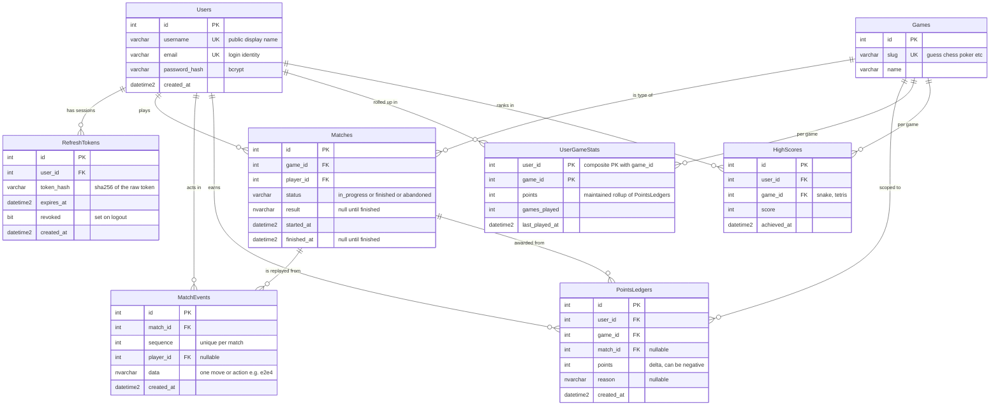
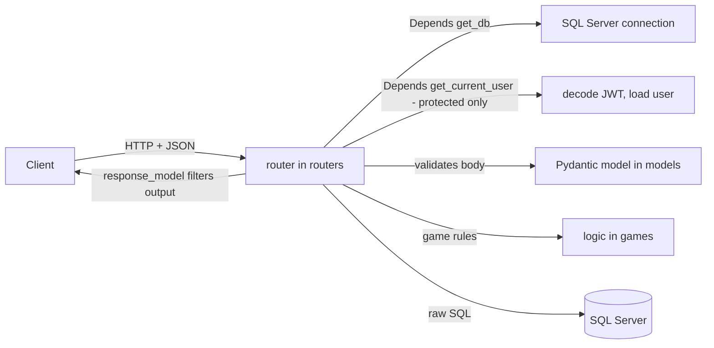
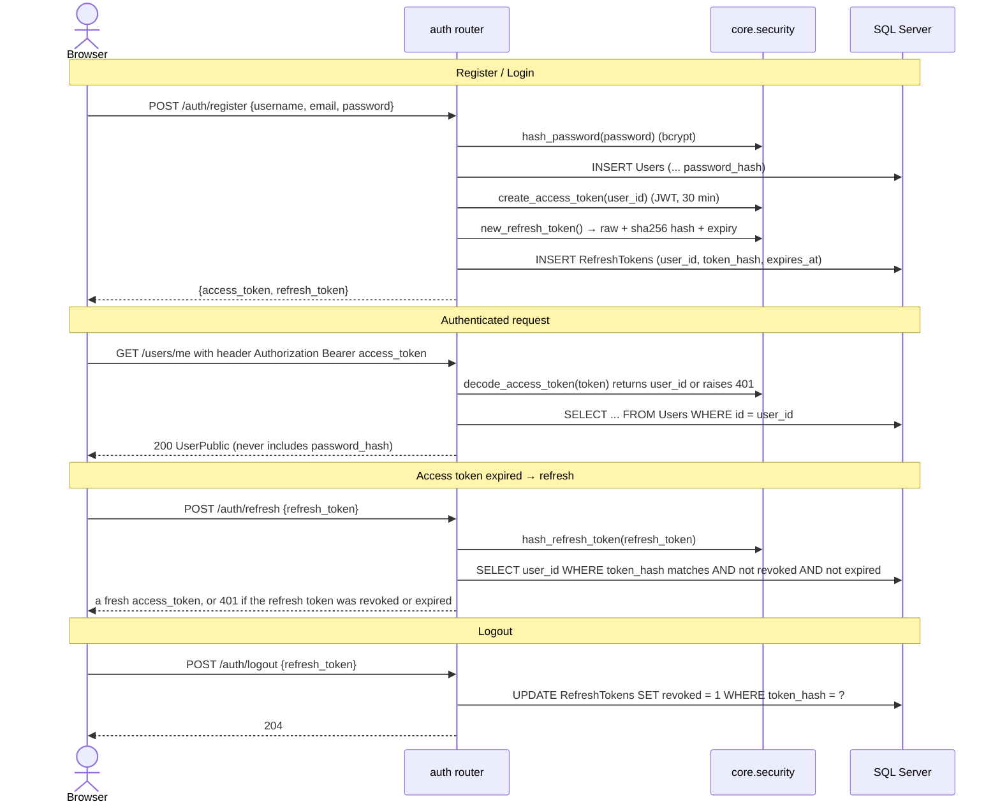
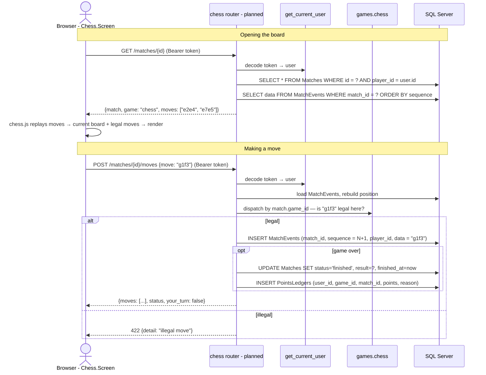

# Architecture

A "Game Hub": users sign in, play small games, and earn points. Points are tracked
**per game and as a total**, and drive a leaderboard.

- **Backend** — FastAPI (`backend/`), talks to **SQL Server** via `pyodbc` (raw SQL, no ORM).
- **Frontend** — React + TypeScript + Vite (`frontend/`), calls the backend over HTTP.
- **Auth** — JWT access tokens + database-backed refresh tokens.
- **Game AI** — Stockfish for chess, a heuristic bot for poker. No paid API (see §8).

> The PNG in this folder is the original FigJam sketch. This doc is the source of truth now —
> it renders on GitHub and in VS Code, and stays in sync with the code.

1. [Database schema](#1-database-schema)
2. [Backend structure](#2-backend-structure)
3. [Frontend structure](#3-frontend-structure)
4. [Auth flow](#4-auth-flow)
5. [Example: one chess move end to end](#5-example-playing-one-chess-move-end-to-end)
6. [Points system](#6-points-system)
7. [Scaling & performance](#7-scaling--performance)
8. [Game AI](#8-game-ai-no-paid-api--ever)
9. [Status](#9-status)

---

## 1. Database schema

Lives in [`backend/database/schema.sql`](../backend/database/schema.sql). The **six core
tables** below are live and constraint-tested against the real `python` database. The
**rollup / planned tables** (`UserGameStats`, `HighScores`, `PasswordResetCodes`) are designed
here but not yet in `schema.sql`.



**Key ideas:**

- **`PointsLedgers` is append-only, the source of truth.** Never edited, never deleted. Every
  points award is one row.
- **`UserGameStats` is the maintained rollup** — one row per (user, game), holding the running
  `points` and `games_played`, updated in the *same transaction* as each ledger insert. Reads
  (profile, leaderboard) hit this, never `SUM` the ledger. Total points = sum of a user's ~5
  `UserGameStats` rows.
- **`Matches` + `MatchEvents` is event sourcing, shared by every turn-based game** (guess,
  chess, poker). One `Matches` row per game played; every move is one `MatchEvents` row. The
  current board / hand is *derived* by replaying the events, not stored.
  `UNIQUE(match_id, sequence)` stops duplicate or out-of-order moves. **`Matches.id` is one
  global sequence** — match `1` might be chess, `2` poker; the `game_id` column says which.
- **Arcade games (snake, tetris) skip `Matches`/`MatchEvents` entirely** and use `HighScores`
  — keep only each user's **top 10 per game** (prune on insert). They still write a
  `PointsLedgers` row so their points count toward the shared total.
- **`RefreshTokens` only stores the hash.** If the DB leaks, a row isn't a usable login. Same
  pattern for the planned `PasswordResetCodes` (user_id, code_hash, expires_at, used) for OTP
  / forgot-password.

---

## 2. Backend structure

```
backend/
├─ main.py                 creates the FastAPI app, includes routers, CORS
├─ core/
│  ├─ security.py          hash_password / verify_password, JWT create/decode, refresh tokens  ✓
│  ├─ deps.py              get_current_user  (the "is this request authenticated?" dependency)  ✓
│  └─ points.py            award_points()  — writes PointsLedgers + UserGameStats in one tx  (planned)
├─ routers/                one APIRouter per area — the HTTP layer
│  ├─ auth.py              POST /auth/register /login /refresh /logout   ✓
│  ├─ users.py             GET /users/me   (protected)   ✓
│  ├─ guess.py             POST /guess/new, POST /guess/{id}   ✓
│  ├─ matches.py           (planned — generic POST /matches, GET/POST /matches/{id})
│  └─ leaderboard.py       (planned — reads UserGameStats)
├─ models/                 Pydantic request/response shapes (NOT database rows)
│  ├─ user.py              CreateUser, UserPublic   ✓
│  ├─ auth.py              RegisterRequest, LoginRequest, RefreshRequest, TokenPair, AccessToken   ✓
│  ├─ game.py              guessing-game shapes   ✓
│  ├─ match.py             (planned — Match, MatchEvent, MoveRequest)
│  └─ leaderboard.py       (planned)
├─ games/                  pure game logic, framework-agnostic (no FastAPI imports)
│  ├─ number_guessing_game/guess.py    ✓
│  ├─ chess/               (planned — wraps Stockfish via python-chess, see §8)
│  ├─ poker/               (planned — heuristic bot + hand evaluator, see §8)
│  └─ snake/ tetris/       (client-side; server only stores HighScores + points)
└─ database/
   ├─ database.py          get_connection(), get_db() dependency   ✓
   └─ schema.sql           the tables above
```

**Request flow** (every request):



**Layering rule:** `routers/` is the only layer that knows about HTTP. `games/` knows only
game rules. `models/` is just shapes. `database/` is just the connection. Keeps each piece
testable on its own.

---

## 3. Frontend structure

```
frontend/src/
├─ main.tsx                bootstraps React into #root
├─ App.tsx                 renders <MainScreen /> inside <main class="container">
├─ index.css               design tokens (light/dark), shared component classes
├─ api.ts                  fetch helpers; base URL from VITE_API_BASE
│                          (planned: attach Bearer token, retry on 401 via /auth/refresh)
├─ auth/                   (planned)
│  ├─ AuthContext.tsx      holds { user, accessToken }, exposes login/register/logout
│  ├─ useAuth.ts
│  └─ Login.Screen.tsx / Register.Screen.tsx
├─ screens/                one per view — navigation shell, no game logic
│  ├─ Main.Screen.tsx      the hub: game cards, useState-based routing to each screen
│  ├─ Guess.Screen.tsx     ✓   (back button + <GuessGame />)
│  └─ Snake/Chess/Poker/Tetris.Screen.tsx   ✓ wired (game components are placeholders)
└─ games/                  the actual game UI + client-side state
   ├─ GuessGame.tsx        ✓ full implementation, talks to /guess/*
   └─ SnakeGame/ChessGame/PokerGame/TetrisGame.tsx   "Coming soon" placeholders
```

`MainScreen` holds a `useState<'main' | 'guess' | 'chess' | ...>` and renders the matching
screen — a router library isn't needed yet. Each `*.Screen.tsx` adds the back button and
per-screen chrome; each `games/*.tsx` is the game itself.

**Chess/poker screens** will, on mount, `GET` the match's `MatchEvents` and replay them into a
board state (a library like `chess.js` turns a move list into the current position), then
`POST` each new move.

---

## 4. Auth flow



**Why two tokens:** the **access token** is a JWT — verified by signature alone, no DB hit, so
it's fast, but can't be revoked before it expires. The **refresh token** is looked up in the
DB every time, so logout can kill it. `/auth/register`, `/auth/login`, `/auth/refresh`,
`/auth/logout` are **public** (chicken-and-egg — you can't require a token to get a token);
everything else uses `Depends(get_current_user)`.

Later: a `PasswordResetCodes` table (user_id, code_hash, expires_at, used) for OTP / forgot
password — same short-lived, single-use, store-only-the-hash pattern as `RefreshTokens`.

---

## 5. Example: playing one chess move, end to end



The server is the referee — it never trusts the client's claim that a move is legal, it
rebuilds the position from `MatchEvents` and checks. `MatchEvents` is the single source of
truth; the rendered board is always derived from it.

**Routing is generic, not per-game.** `POST /matches` (body says `{"game": "chess"}`) →
returns the new global `id`. `GET /matches/{id}` and `POST /matches/{id}/moves` are one router
that dispatches to the right game logic by the row's `game_id`. The `{id}` is the global
`Matches.id` — there is no "chess match 1" separate from "poker match 1".

---

## 6. Points system

`PointsLedgers.game_id` is on every row, so **per-game breakdown is a `GROUP BY`** and needs
no extra structure. `UserGameStats` is the rollup so reads never scan the ledger.

### Write path — one shared helper, one transaction

Every game calls this once, when a match ends:

```python
def award_points(conn, user_id, game_id, match_id, points, reason):
    cur = conn.cursor()
    cur.execute(
        "INSERT INTO dbo.PointsLedgers (user_id, game_id, match_id, points, reason) "
        "VALUES (?, ?, ?, ?, ?)",
        (user_id, game_id, match_id, points, reason),
    )
    cur.execute("""
        MERGE dbo.UserGameStats AS t
        USING (SELECT ? AS user_id, ? AS game_id) AS s
          ON t.user_id = s.user_id AND t.game_id = s.game_id
        WHEN MATCHED THEN
          UPDATE SET points = t.points + ?, games_played = t.games_played + 1,
                     last_played_at = SYSUTCDATETIME()
        WHEN NOT MATCHED THEN
          INSERT (user_id, game_id, points, games_played, last_played_at)
          VALUES (s.user_id, s.game_id, ?, 1, SYSUTCDATETIME());
    """, (user_id, game_id, points, points))
    conn.commit()
```

### Per-game scoring (each game module owns its formula)

| Game | `points` on match end |
|---|---|
| Guess | `max(100 - (attempts - 1) * 10, 10)` — already in `games/number_guessing_game/guess.py` |
| Chess | win → 30, draw → 10, loss → 0 |
| Poker | net chips this session, scaled (or fixed ± per hand) |
| Snake / Tetris | `f(final_score)` — `match_id = NULL`, still flows into the shared total |

### The normalization decision (product, not schema)

Raw snake scores (thousands) would dwarf guess scores (max 100), so the "total" leaderboard
becomes "who plays snake." Pick one:

1. **Raw sum** — simplest, snake dominates.
2. **Normalize** — every game awards 0–100 "hub points" regardless of its internal score
   (snake maps its score onto tiers). The total stays meaningful.
3. **Separate leaderboards** — one per game, plus an "Overall" that sums normalized points.

The schema supports all three; decide before writing the per-game formulas.

### Read path / API

`GET /users/me` returns both:
```json
{
  "points_total": 340,
  "points_by_game": [
    {"slug": "guess", "name": "Number Guessing", "points": 240, "games_played": 4},
    {"slug": "snake", "name": "Snake", "points": 100, "games_played": 12}
  ]
}
```
Frontend: profile shows the total up top + a row per game. Leaderboard has tabs — "Overall" +
one per game — each sorting by the matching column in `UserGameStats`.

---

## 7. Scaling & performance

At **1000–5000 users** this stays small. Turn-based games (chess/poker/guess) are dominated by
`MatchEvents` (~80–100 bytes/row). A chess game is ~40–80 moves ≈ ~6–8 KB; at ~3 games/user/
week that's **≈ 4–5 GB/year**, or ~15–20 GB with heavy poker sessions. `HighScores` is capped
at `users × arcade_games × 10` rows ≈ **~10 MB, forever**.

> **SQL Server Express caps each database at 10 GB.** Fine for 1000 users for years; at 5000
> active users you'd want a non-Express edition or an archival step within ~2 years.

### What actually slows down

- Indexed point lookups (`WHERE id = ?`, `WHERE user_id = ?`) — barely, ever (B-tree is O(log n)).
- **Unindexed queries** — linearly. Avoid.
- **Aggregations over a big range** (`SUM(points)` across the whole ledger) — linearly. This is
  why `UserGameStats` exists.

### The ladder (reach for these in order)

1. **Indexes** — `PointsLedgers(user_id)`, `Matches(player_id, game_id)`,
   `RefreshTokens(token_hash)` UNIQUE, `HighScores(user_id, game_id, score DESC)`,
   `UserGameStats(game_id, points DESC)` for the per-game leaderboard.
2. **Rollup column / table** — `UserGameStats`, maintained on write (see §6). Reads never touch
   the ledger.
3. **Cache the leaderboard** — compute top 100 every 1–5 minutes into Redis / memory / a tiny
   table. Leaderboards tolerate staleness.
4. **Pagination** — `TOP 100`, never `SELECT *`. Match history uses keyset pagination
   (`WHERE id < :last_seen`), not `OFFSET`.
5. **Archival / partitioning** — only at tens of millions of rows. Not needed at this scale.

---

## 8. Game AI (no paid API — ever)

Game AI is search / rules / self-play, not an LLM. Stockfish, Pluribus, AlphaZero make **zero
API calls** at runtime. The only cost is your own CPU for training, if any.

### Chess — use Stockfish, don't build anything

Free, open source, strongest engine there is. Run it as a subprocess via `python-chess`:
```python
import chess, chess.engine
engine = chess.engine.SimpleEngine.popen_uci("stockfish")
engine.configure({"Skill Level": 5})   # 0–20, dials difficulty
move = engine.play(board, chess.engine.Limit(time=0.1)).move
```

### Poker — the ladder

1. **Heuristic + hand evaluator (start here).** Free libs (`pokerkit`, `treys`, `deuces`)
   score a 5–7 card hand in microseconds. Then rules: bet when `equity > pot_odds`, fold
   otherwise, add randomness. ~150 lines. This is what most casual poker apps ship.
2. **Monte Carlo equity.** For each decision, deal the remaining cards ~2000 times vs random
   opponent hands → true equity for that exact spot. Milliseconds per decision.
3. **CFR self-play.** Counterfactual Regret Minimization is the poker algorithm.
   [`open_spiel`](https://github.com/deepmind/open_spiel) has it built in; on a laptop you can
   train a strong bot for a simplified variant (Leduc, limit hold'em) in hours. Full no-limit
   needs abstraction — a real project. Output is a strategy table you ship, no runtime cost.

Start with #1; upgrade to #2 if it feels weak. Only touch #3 if poker AI becomes the thing you
want to learn.

---

## 9. Status

| Area | Done | Planned |
|---|---|---|
| **DB schema** | 6 core tables, live in `python` DB | `UserGameStats`, `HighScores`, `PasswordResetCodes`; seed `Games` rows |
| **Auth** | register / login / refresh / logout, `get_current_user`, bcrypt, JWT — tested end to end with curl (§4) | frontend `AuthContext`, `api.ts` token attach + 401 refresh, login/register screens |
| **Users** | `GET /users/me` (protected) | return `points_by_game` + `points_total` (§6) |
| **Points system** | design decided (§6) | `UserGameStats` table, `award_points()` helper, per-game formulas, normalization choice |
| **Guessing game** | full stack — `games/`, `routers/guess.py`, `GuessGame.tsx` | call `award_points()` on win (needs frontend auth first) |
| **Matches / MatchEvents** | schema only | generic `routers/matches.py` (`POST /matches`, `GET/POST /matches/{id}`), `models/match.py`, per-game logic in `games/`, chess/poker screens |
| **Chess** | — | `games/chess` wrapping Stockfish (§8), `routers` dispatch, `ChessGame.tsx` board |
| **Poker** | — | `games/poker` heuristic bot + hand evaluator (§8), `PokerGame.tsx` |
| **Leaderboard** | — | `routers/leaderboard.py` reading `UserGameStats` (overall + per-game), cache layer, hub screen |
| **Snake / Tetris** | screens wired, placeholder components | client-side game loop; `HighScores` (top 10) + one `award_points()` row per game |

### Endpoints today

| Method | Path | Auth | Status |
|---|---|---|---|
| POST | `/auth/register` | — | ✓ |
| POST | `/auth/login` | — | ✓ |
| POST | `/auth/refresh` | — | ✓ |
| POST | `/auth/logout` | — | ✓ |
| GET | `/users/me` | Bearer | ✓ |
| POST | `/guess/new` | — | ✓ (add Bearer later) |
| POST | `/guess/{game_id}` | — | ✓ |
| GET | `/items` | — | test endpoint, will be removed |

### Endpoints planned

| Method | Path | Notes |
|---|---|---|
| POST | `/matches` | body `{game}` → new global match id |
| GET | `/matches/{id}` | generic; dispatches by `game_id` |
| POST | `/matches/{id}/moves` | generic; server validates the move |
| GET | `/leaderboard` | overall, from `UserGameStats`, cached |
| GET | `/leaderboard/{game}` | per-game |
| POST | `/highscores` | snake / tetris final score |
